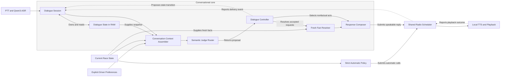

# CE-04 architecture: dialogue sessions and semantic judgment

Updated 2026-09-24. Revision 2 of the proposed conversational architecture. This is a
design for CE-04 and its CE-05 live integration; the current runtime still uses the v1
conversation path. See the [delivery plan](context-engine-implementation-plan.md) and
[behavior scenarios](conversational-core-design.md) for scope and acceptance criteria.

## Names and ownership

The session manager coordinates a turn and owns mutable conversation memory. A context
assembler prepares the immutable input for that turn. A semantic judge proposes meaning.
Application code validates that meaning, retrieves facts, and controls the reply.

| Component | Responsibility | State ownership |
| --- | --- | --- |
| `DialogueSession` | Admit turns, coordinate components, enforce deadlines, handle resets/cancellation and delivery callbacks | Sole writer of dialogue state; evolves the existing `ConversationSession` boundary |
| `DialogueState` | Recent utterances/meanings, topic, opponent references, pending clarification, and delivery outcomes | Bounded RAM owned by the session; optional raw utterances use the same retention bounds |
| `ConversationContextAssembler` | Combine a current race view, dialogue snapshot, and explicit preferences into one immutable input | Stateless; never resets a session or updates history |
| `SemanticJudge` | Propose query parts, conversational acts, corrections, references, and unresolved meanings | Model adapter; no access to mutable session state or preference writes |
| `JudgeRouter` | Invoke the configured primary judge and at most one eligible Qwen fallback | Per-turn attempt/deadline bookkeeping |
| `DialogueController` | Validate proposals and choose answer, partial answer, clarification, acknowledgment, unavailable, or no-reply | Produces proposed state transitions; session applies them after identity/version checks |
| `FactResolver` | Resolve supported requests against fresh facts and stable opponent identities | Reads current race state; calculations remain in validated providers |
| `ResponseComposer` | Produce bounded bilingual wording from approved acts and grounded facts | Stateless; cannot introduce extra factual claims |
| Existing radio and speech adapters | Schedule, expire, interrupt, synthesize, play, and report delivery | Own playback lifecycle; session consumes their outcomes |

These are internal modules in the existing Python application. Only heavy inference has
a worker/server boundary. The architecture does not require a service deployment for each
box. Domain contracts continue to import no model, simulator, or UI SDKs.

## Component flow

The arrows show data flow and callbacks. `DialogueSession` coordinates the calls and
commits state transitions; the modules shown inside the core execute under that lifecycle.
The router's model choices are described below the diagram.

No-reply decisions finish inside the session and do not enter synthesis. The radio reports
expiry or cancellation even when synthesis never starts. Critical automatic calls reach
the radio through the existing strict policy and remain independent of semantic inference.

## Where Laya, MiniLM, and Qwen fit

`SemanticJudge` is the common interface. "Semantic interpreter" in earlier discussion
meant this same role. There is no additional learned validator after it.

Evaluate Laya and MiniLM as alternative primary judges. Also evaluate Qwen with the new
input/output contracts. A deployment selects one primary: an accepted small judge or Qwen
if the small candidates do not earn promotion. A small primary may have Qwen as its single
optional fallback. The evaluation harness runs candidates separately; it does not imply
loading all candidates into the live application.

| Primary outcome | Controller/router behavior |
| --- | --- |
| Complete, validated interpretation meets calibrated acceptance criteria | Proceed to fresh fact resolution or the selected social act |
| Meaning is understood but a referent is genuinely missing | Ask the targeted clarification directly; another model cannot manufacture the missing reference |
| Meaning is understood but data/calculation is unavailable | Explain that limitation; do not spend a fallback call on missing telemetry |
| Proposal is uncertain, inconsistent, or fails to interpret a complex request | Try Qwen once if enabled and the remaining deadline/residency permits; otherwise clarify or report the failure |
| Fallback is still uncertain or invalid | End with one bounded clarification/unavailable outcome; no further model chain |
| Turn/session is invalidated or expired | Discard the result and invalidate its proposed state changes |

The router uses the controller's deterministic proposal-validation operation before
accepting either model's output. Both passes apply the same guards. After routing, the
controller chooses the final response action and proposes the corresponding memory update.
Semantic confidence and fact availability remain separate. A valid JSON shape alone does
not qualify a result for acceptance.

For Laya, bounded binary choices are an adapter experiment. For MiniLM, bounded natural
language hypotheses are an adapter experiment. Each adapter must combine its outputs into
one coherent proposal and permit abstention. Total work includes every hypothesis, batch,
pass, and decoding/validation step. Multilingual calibration and dialogue tests determine
whether either approach understands our context reliably.

Each request part carries its own reference. Asking for both gaps is valid. Conflicting
references for the same unresolved part require repair or clarification; the controller
must not reject a valid compound request simply because both ahead and behind occur.

## Contracts crossing the boundaries

Final class fields and limits will be implemented in CE-04b; these are the required
semantics. Use explicit schema versions for serialized successors to the current contracts.

| Proposed contract | Required information |
| --- | --- |
| `DialogueTurnInput` | Turn/session/generation IDs, dialogue revision, transcript, ASR language hint, explicit reply-language preference, immutable compact context, and remaining time budget |
| `SemanticProposal` | Individually identified request parts, per-part references, social/correction acts, unresolved parts, reason codes and model/calibration version |
| `GroundedAnswer` | Request-part ID, available/missing/unsupported outcome, verified value/unit if present, source sequence and opponent identity where applicable |
| `ResponseDecision` | Response acts, grounded answer references, unresolved parts, proposed state transition, explicit no-reply choice, and expiry |
| `DeliveryEvent` | Turn/response/session/generation IDs, output mode, lifecycle outcome, and delivered extent only when known |

Preserve `conversation-plan.v1` and its Qwen baseline for existing entry points until an
explicit integration switch. Its query-or-clarification contract cannot silently become a
mixed-act proposal. Bridge only representable v1 cases and reject incompatible versions
explicitly. The existing `ConversationPlanner` remains the v1 interface; `SemanticJudge`
is its new conversation boundary, with its own conformance tests.

## One turn through the system

For the illustrative input "That was dirty. Gap behind?":

1. The application records the connection generation and PTT-release time before ASR.
   The session admits the transcript with that origin and remaining turn budget, assigns
   its turn ID, and takes a versioned memory snapshot. It keeps ASR's language hint separate
   from an explicit profile language override, so automatic language choice can use context.
2. The assembler combines this snapshot with current capabilities, relevant events,
   freshness, and stable opponent references. It includes only bounded relevant context.
3. The selected judge proposes acknowledgment of a driver report plus a gap-behind request.
   It neither verifies the alleged incident nor supplies a race value.
4. The controller checks the proposal, including reference consistency and unsupported
   parts. The router performs at most one eligible fallback if this check cannot accept it.
5. The fact resolver reads the latest valid gap for the resolved opponent. The controller
   chooses the response acts; the composer can produce "Copy. Car behind is 2.3 seconds
   back" only if those illustrative facts are available.
6. The session commits the received meaning and proposed response separately. At the radio
   slot, facts and references are refreshed and the reply is recomposed from its approved
   acts. This preserves acknowledgment and any clarification alongside refreshed numbers.
7. After synthesis, the pre-playback gate checks session/generation, freshness, and relevant
   reference validity again. Changed meaning/reference or expired facts discard the audio;
   synthesis is not retried indefinitely. Delivery outcomes update the session by ID.

The current `LiveRaceState.refresh()` rebuilds replies from factual answers. CE-05 must
extend that boundary to preserve mixed response acts and per-part references; simply
passing the new reply through the old refresh function would lose social/clarifying text.
Pre-playback freshness checks bound the age of synthesized values; they do not imply
sample-exact numbers while the car continues to move.

## Working memory and lifecycle

Dialogue memory resembles a short chat history plus explicit working state. Retain the
recent utterances and selected meanings needed for context, active topic, pending
clarification, referenced opponents, and delivery outcomes. Old numeric answers never
become the source of current facts. Raw utterances are optional bounded RAM context;
normal diagnostics use IDs, timings, and reason codes.

The session is the sole state writer. The controller returns transition proposals;
assemblers, model workers, and playback callbacks cannot directly mutate memory. Serialize
state commits without blocking telemetry on inference. Check turn/generation and relevant
state revision before applying late results. A relevant context change during inference
causes discard or bounded clarification rather than committing an obsolete interpretation.

Distinguish accepted, queued, started, completed, interrupted, cancelled, expired, and
failed responses. An output-mode field distinguishes displayed text from audible playback;
text-only completion cannot claim speech was delivered. Duplicate/late delivery events
must be idempotent and cannot revive cleared memory. Completion does not prove the driver
understood a reply.

Session changes, connection-generation changes, replay seeks, and explicit resets clear
session memory and in-flight work. Retain durable explicit preferences. Opponent references
use normalized `driver_id` scoped to the session/generation, with continuity validated
against the current frame. A reused relative slot must not silently inherit the old car's
identity. A pending clarification retains the unresolved request and expires on its own
deadline or an explicit topic change.

CE-04b will document configurable topic/reference/clarification lifetimes and pending-turn
limits before tests are frozen. Start from the existing history bound (default six turns,
maximum twelve) and current freshness boundary. Do not infer end-to-end deadlines from
the model HTTP timeout: ASR, inference, synthesis, and radio waiting share a turn budget.

## Processes, resources, and the two judge roles

Keep application orchestration and telemetry independent. The proposed small-judge adapter
uses a persistent, owned local worker with bounded requests, CPU threads, timeout and
shutdown behavior. Its optional dependencies load only when selected. Qwen keeps the
existing local llama.cpp server boundary. ASR and TTS keep their current local workers.
Missing artifacts produce a clear unavailable result; normal operation does not download
models. Fake adapters require none of the model packages.

One primary plus an optional fallback defines live residency. Qwen fallback can be disabled,
loaded on demand, or warm. Benchmark the actual combined RAM and cold-start cost with ASR,
TTS, and the simulator. A small judge alone does not reduce memory while Qwen stays loaded.
CPU remains a complete target; CE-03 measures optional acceleration immediately before CE-08.

CE-04's semantic judge answers "What does the driver mean?" CE-06's proactive usefulness
ranker answers "Is this eligible noncritical call useful now?" They share validated race
features but have separate contracts, labels, calibration, queues, and promotion gates.
CE-06 starts with a deterministic baseline and a local statistical ranker in shadow mode.
Using Laya for semantics neither selects it for ranking nor proves ranking quality. A later
Laya ranking experiment would need its own evidence. Critical calls bypass both learned roles.

## Implementation mapping and first reviewable change

Proposed new modules are organizational boundaries; retain existing files where extension
keeps compatibility clearer.

| Existing foundation | CE-04/05 work |
| --- | --- |
| `core/conversation.py`, `core/interfaces.py` | New versioned dialogue contracts in `core/dialogue.py` and a `SemanticJudge` protocol; retain v1 |
| `conversation/session.py` | Evolve orchestration to `DialogueSession`; extract bounded state/reducers to `conversation/state.py` |
| `policy/context.py`, `conversation/live.py` | Reuse race calculations and snapshots; add stateless `conversation/context_view.py` |
| Planner factory and local model adapter | Add `conversation/router.py` and separately selectable Laya/MiniLM/Qwen-v2 adapters |
| `conversation/answers.py` | Reuse fact providers and extend grounded per-part resolution plus `conversation/composer.py` |
| Session orchestration logic | Extract deterministic proposal checks and decisions to `conversation/controller.py` |
| `application/live_conversation.py`, radio and Piper | CE-05 composition, mixed-act refresh, ID-tagged delivery callbacks and output-mode handling |
| Existing evaluation runner | Add versioned dialogue scenarios, calibration, split audits and fake-clock delivery events |

CE-04b's first reviewable change implements contracts, state transitions, context assembly,
and controller/session behavior with a scripted judge and fake clock/delivery events. Its
tests cover pronoun ambiguity, valid compounds, corrections, partial answers, clarification
expiry, opponent replacement, duplicate delivery callbacks, text-only outcomes, and reset
during inference. Production activation is CE-05 after evaluation and routing decisions.
